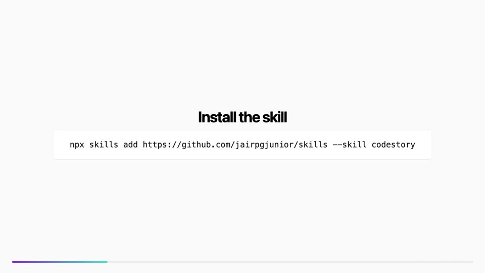

# CodeStory

[](./1-codestory.mp4)

Agent Skill: turn GitHub PR changes into a short Remotion storytelling video for your team.

## Install

```bash
npx skills add https://github.com/jairpgjunior/skills --skill codestory
```

Or copy the `codestory/` folder into your agent skills directory.

## Usage

In a repo with an open PR and `gh` authenticated:

> "Run codestory on this PR"

The agent will draft a Pixar-style script in `docs/codestory/`, wait for your approval, then render and update the PR description.

## Requirements

- GitHub CLI (`gh`)
- Node.js 18+
- Optional: `DESIGN.md` at repo root or under `docs/`, `.design/`, or `design/`

## License

MIT

## Demo

<video controls width="640">
  <source src="1-codestory.mp4" type="video/mp4">
  Your browser does not support the video tag.
</video>
